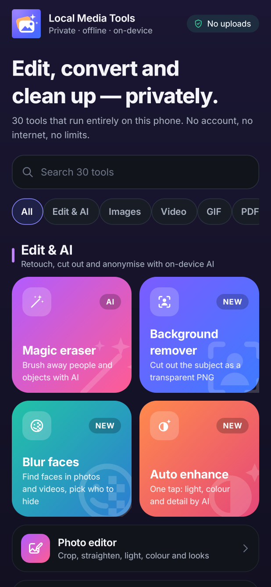
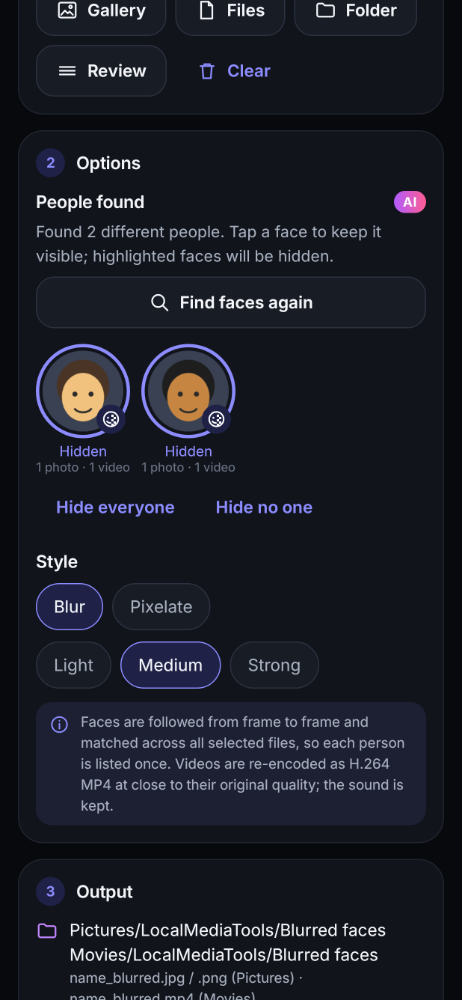
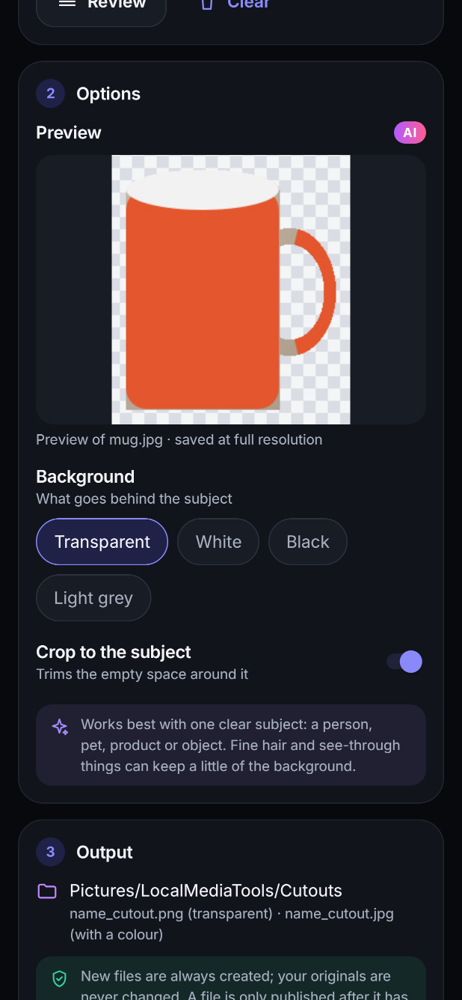
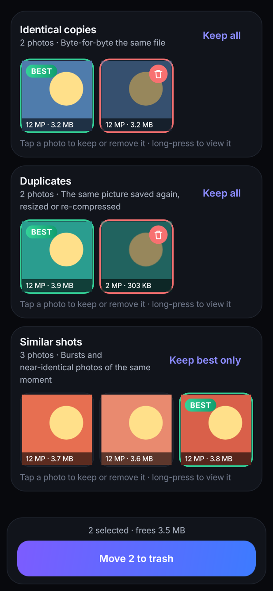
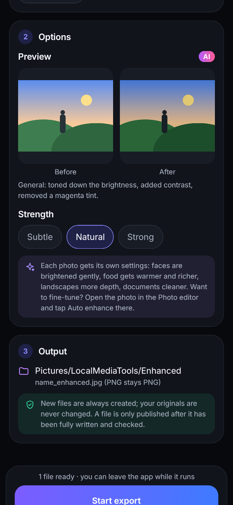
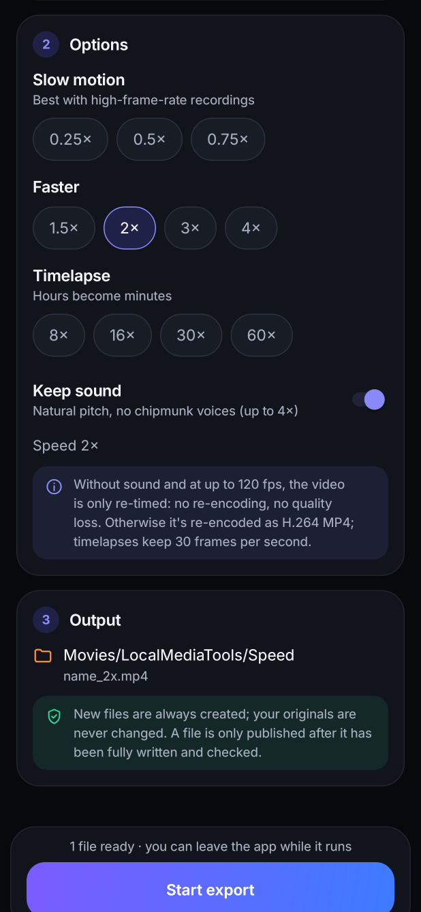
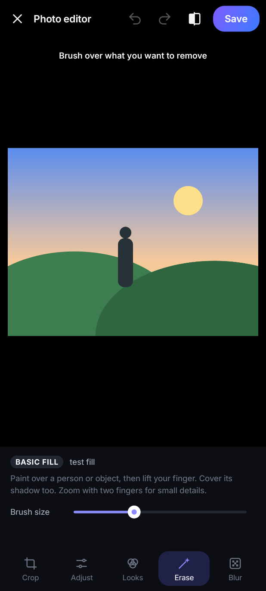
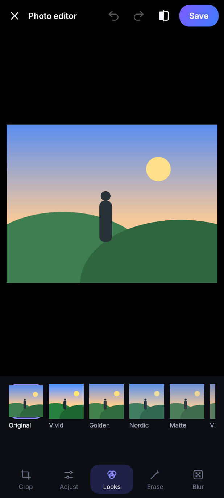
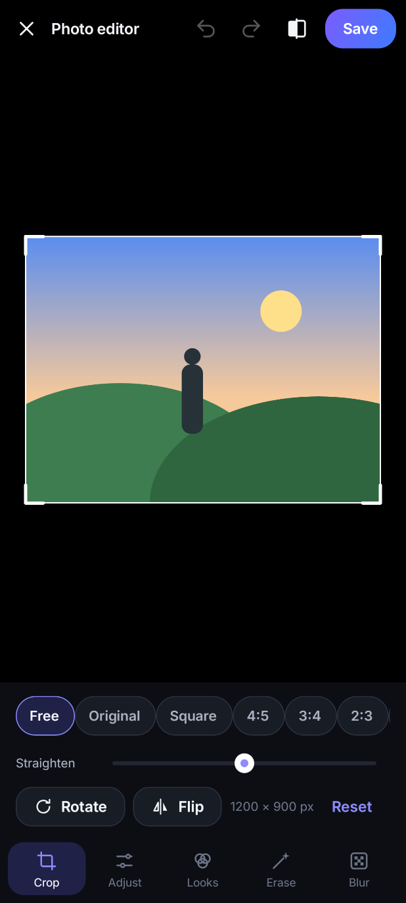
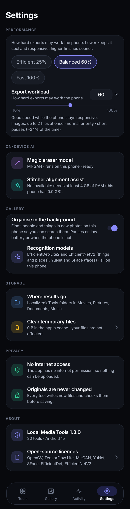

# Local Media Tools (Android)

A private, fully on-device media toolbox: **30 tools** for photos, video, GIF, PDF and audio,
including on-device AI for **face blurring in photos and videos**, **background removal**,
**one-tap enhancement**, a **magic eraser** and a **duplicate finder**. Nothing is uploaded (the
app has no internet permission), originals are never modified, and every result is written to a
hidden file that is only published after it has been completely written and checked.

**Install:** [`release/LocalMediaTools-1.2.0.apk`](release/LocalMediaTools-1.2.0.apk)
(Android 10 or newer, arm64 / armv7; allow "install unknown apps" for your file manager or browser).
It installs over 1.1.0 (same signing key).

| Home | Blur faces | Background remover | Duplicate finder | Auto enhance | Speed & timelapse |
|---|---|---|---|---|---|
|  |  |  |  |  |  |

| Magic eraser | Looks | Crop & straighten | Settings |
|---|---|---|---|
|  |  |  |  |

## What's new in 1.2

- **Blur faces (photos and videos)** — [YuNet](https://github.com/opencv/opencv_zoo/tree/main/models/face_detection_yunet)
  finds every face; [SFace](https://github.com/opencv/opencv_zoo/tree/main/models/face_recognition_sface)
  recognises the same person across frames and across all the selected files, so each person is
  listed once with a face picture. Tap who to hide (everyone is pre-selected), choose blur or
  pixelate and a strength. In videos, faces are tracked frame to frame (sampled several times a
  second, interpolated in between, never merging two faces seen at the same moment) and hidden on
  the GPU while re-encoding; the sound is kept as is. In photos, the hiding scales with the face so
  close-ups are anonymised too. The photo editor's Blur tab also has **Hide all faces**.
- **Background remover** — [U²-Net-p](https://github.com/xuebinqin/U-2-Net) (as packaged by
  [rembg](https://github.com/danielgatis/rembg)) finds the subject; a guided filter snaps the mask
  to real edges. Transparent PNG or white/black/grey background, optional crop to the subject,
  live preview, batch.
- **Auto enhance** — one tap in the editor's Adjust tab, or a batch tool. Faces (YuNet) and the
  kind of scene (EfficientNet-Lite0: food, landscape, plants, city, documents, animals, night…)
  steer exposure, contrast, highlights/shadows, white balance, vibrance and sharpening. The result
  is ordinary editor settings, so you can still fine-tune them.
- **Duplicate finder** — scans the photo library (asks for photo access only when you start it):
  identical files (SHA-256), re-saved/resized copies (difference hash) and near-identical shots
  (MobileNet-V3 image embeddings, with a looser threshold for bursts taken seconds apart). The
  sharpest, largest photo is marked as the best; copies are pre-selected; moving to the trash goes
  through Android's own confirmation and can be undone from the gallery for 30 days. Results are
  cached, so later scans only look at new photos.
- **Merge videos** — clips recorded with the same settings are joined without re-encoding;
  otherwise each is converted to a common size (letterboxed), frame rate and AAC sound (silence
  for clips without sound) and then joined.
- **Speed & timelapse** — 0.25× to 60×. Sound keeps its natural pitch (WSOLA time-stretching) up
  to 4×; muted copies up to 120 fps are only re-timed (no re-encoding); timelapses are smooth 30 fps.

## What was new in 1.1

- **Magic eraser** — brush over people or objects; [MI-GAN](https://github.com/Picsart-AI-Research/MI-GAN)
  (MIT) converted to TensorFlow Lite fills the gap on the phone. It works on a window around the
  stroke, so full-resolution photos keep their detail; edges are feathered and grain is matched.
  Falls back to a classic fill (OpenCV Telea) where the model can't run.
- **Photo editor** — crop with aspect presets, rotate, flip, straighten (auto-zoomed so no empty
  corners), 11 adjustments (exposure, brightness, contrast, highlights, shadows, saturation,
  vibrance, warmth, tint, sharpness, vignette), 10 looks with strength, undo/redo, hold-to-compare.
  Saving runs in the background at full resolution in memory-bounded strips.
- **Blur & pixelate** brushes to hide faces, number plates or addresses.
- **Trim & rotate video** (lossless), **Extract PDF pages**, **Remove metadata** (GPS, camera,
  dates, XMP, hidden thumbnails and extra images; pixels copied byte for byte, orientation and
  colour profile kept).
- **New design** — Tools / Activity / Settings navigation, tool search with synonyms, categories,
  Inter typeface, gradient tool icons, a new adaptive app icon with a themed (monochrome) layer.

## Tools

| Section | Tool | What it does | Saved to |
|---|---|---|---|
| Edit & AI | Photo editor | Crop, rotate, straighten, adjustments, looks, auto enhance | `Pictures/LocalMediaTools/Edited` |
| | Magic eraser | On-device AI object removal | `Pictures/LocalMediaTools/Edited` |
| | Blur & pixelate | Privacy brushes, hide all faces | `Pictures/LocalMediaTools/Edited` |
| | Background remover | AI cut-out, transparent PNG or plain colour | `Pictures/LocalMediaTools/Cutouts` |
| | Auto enhance | AI-assisted one-tap fixes, batch | `Pictures/LocalMediaTools/Enhanced` |
| | Blur faces | Find faces in photos and videos, choose who to hide | `Pictures/…/Blurred faces`, `Movies/…/Blurred faces` |
| Images | Image compressor | JPEG/WebP, quality, max width (0 = original), never saves a larger file | `Pictures/LocalMediaTools/Compressed` |
| | Lossless image optimizer | Pixel-identical PNG or lossless WebP | `Pictures/LocalMediaTools/Compressed` |
| | Convert images | PNG/JPEG/WebP from HEIC, AVIF, TIFF, BMP, PSD, QOI, PNM, TGA, … | `Pictures/LocalMediaTools/Converted` |
| | Merge images | Vertical / horizontal / smart pack; no scaling; streamed in strips | `Pictures/LocalMediaTools/Merged` |
| | Multi-shot stitcher | Panoramas and flat scans in any arrangement, optional AI alignment assist | `Pictures/LocalMediaTools/Stitched` |
| | Bulk watermark | Text and/or logo, per-aspect-ratio placement | `Pictures/LocalMediaTools/Watermarked` |
| | Duplicate finder | Copies and similar shots in the photo library, best one kept | — (moves to the system trash) |
| Video | Split videos | Equal-length parts, stream copy | `Movies/LocalMediaTools/Splits` |
| | Trim & rotate video | Keep a range (start snaps to a keyframe), 90° turns, no re-encode | `Movies/LocalMediaTools/Trimmed` |
| | Lossless video optimizer | Remux to a fast-start MP4 | `Movies/LocalMediaTools/Optimized` |
| | Video compressor | H.264 re-encode, quality 20–100 | `Movies/LocalMediaTools/Compressed` |
| | Merge videos | Join clips in your order; lossless when possible | `Movies/LocalMediaTools/Merged` |
| | Speed & timelapse | 0.25×–60×, natural-pitch sound | `Movies/LocalMediaTools/Speed` |
| | Remove video audio | Video stream copied, audio dropped | `Movies/LocalMediaTools/NoAudio` |
| GIF | Video → GIF | FPS, width, source mode, adaptive colours | `Pictures/LocalMediaTools/Converted/GIF` |
| | GIF compressor | Width, FPS, 32/64/128/256 colours | `Pictures/LocalMediaTools/GIFs` |
| | GIF optimizer | Pixel-preserving re-pack | `Pictures/LocalMediaTools/GIFs` |
| PDF | PDF → images | PNG/JPEG, scale 50–400 % | `Pictures/LocalMediaTools/PDF Images` |
| | Images → PDF | A4 pages in your order | `Documents/LocalMediaTools/PDF` |
| | Merge PDFs | Structural merge: text and links kept | `Documents/LocalMediaTools/PDF` |
| | Extract PDF pages | `1-3, 5, 8-` into one PDF or one per page | `Documents/LocalMediaTools/PDF` |
| | PDF scanner | Camera and gallery pages, A4 | `Documents/LocalMediaTools/PDF` |
| Privacy & audio | Remove metadata | Lossless clean copies of JPEG/PNG/WebP/GIF and videos | `Pictures/…/Clean`, `Movies/…/Clean` |
| | Extract audio | AAC track to M4A without re-encoding | `Music/LocalMediaTools/Extracted Audio` |

Exports run in a foreground service with progress notifications and one queue for the whole app.
The **Export workload** setting (10–100 %, Efficient / Balanced / Fast) controls parallelism,
thread priority, pauses and the memory budget, live, even mid-export.

## Building

No Android SDK or Gradle is needed; the build uses a pinned, self-downloaded toolchain
(aapt2, android.jar 35, Kotlin compiler, D8, apksigner).

```bash
python3 buildtools/fetch_toolchain.py                # once: downloads + verifies the toolchain into .toolchain/
python3 buildtools/build_apk.py                      # -> build/LocalMediaTools.apk (signed)
python3 buildtools/build_apk.py --test               # + JVM unit tests
python3 buildtools/fetch_toolchain.py --robolectric  # once, optional (needs mvn)
python3 buildtools/build_apk.py --robo-test          # + Android-framework tests in Robolectric
```

The on-device models are committed in `app/src/main/assets/models/` with their licences in
`app/src/main/assets/licenses/` (also shown in Settings → Open-source licences): YuNet (MIT) and
SFace (Apache-2.0) from the OpenCV Zoo, U²-Net-p (Apache-2.0, via rembg, MIT) and EfficientNet-Lite0
(Apache-2.0, MediaPipe). The ONNX models run through OpenCV's DNN module, the TFLite ones through
TensorFlow Lite. The eraser model (`migan_512_fp16.tflite`, 14 MB) is committed too;
`buildtools/models/convert_migan.py` reproduces it byte for byte from the published MI-GAN weights
(TorchScript → ONNX → TFLite float16 with TensorFlow 2.16.1, matching the app's TFLite runtime) and
checks it against PyTorch. Google's Maven repository wasn't reachable from the build environment,
so the app uses only the Android framework (no AndroidX) plus kotlinx-coroutines, OpenCV,
pdfbox-android and TensorFlow Lite from Maven Central.

The release APK is signed with the sideload key in `buildtools/signing/` (password `localmediatools`)
so updates install over each other; use your own key for a store release.

## Tests

* `app/src/test` — 61 JVM tests: codecs, orientation, layouts, MP4 fast start, stitching, editor
  geometry and colour pipeline, masks and mosaics, the metadata stripper (JPEG/PNG/WebP/GIF), the
  real vision models (face detection and recognition, tracking and grouping people across photos
  and videos, cut-out masks, scene recognition, auto enhance, duplicate grouping) and the sound
  pipeline (resampling, channel mixing, pitch-preserving speed changes).
* `app/src/roboTest` — 35 Robolectric tests (Android 15 runtime, native graphics): EXIF orientation
  through decoding and export; every image, GIF and PDF tool end to end; the editor at full
  resolution (rotation, flip, crop, straighten, colours equal to the preview pipeline, eraser and
  privacy brushes); the editor UI (brush stroke → erase → undo/redo → rotate → save); metadata
  removal keeping photos upright; page extraction; background removal, auto enhance and photo face
  blurring end to end (with stand-ins for the native models); and a pass that opens all 30 tools
  from the home screen. `LMT_SHOTS=<dir>` also renders the screenshots above.

Not covered by automated tests (no emulator here): MediaCodec/MediaExtractor video paths (including
the GPU face blur, merging and speed changes), PdfRenderer, BitmapRegionDecoder, the camera intent,
the photo-library scan and trash request, and the native OpenCV/TFLite code on a device (the models
themselves are tested on the JVM with OpenCV's desktop build, and the eraser model against PyTorch).
