# Local Media Tools (Android)

A private, fully on-device media toolbox: a **Gallery** that finds people and things in your
photos and lets you search them in plain words, **highlight videos** cut to music the phone writes
itself, **printing** to Wi-Fi printers without the printer maker's app, and **32 tools** for photos,
video, GIF, PDF and audio, including on-device AI for **face blurring in photos and videos**,
**background removal**, **one-tap enhancement**, a **magic eraser** and a **duplicate finder**. Nothing is uploaded: the app never connects to servers
on the internet (its only network traffic is to your own printer, and the code allows nothing else),
originals are never modified, and every result is written to a hidden file that is only published
after it has been completely written and checked.

**Tool stacks** chain any of them: pick files once, add steps (for example Blur faces → Video
compressor → Video → GIF → GIF optimizer) and run them all with one tap.

**Install:** [`release/LocalMediaTools-1.7.0.apk`](release/LocalMediaTools-1.7.0.apk)
(Android 10 or newer, arm64 / armv7; allow "install unknown apps" for your file manager or browser).
It installs over earlier versions (same signing key).

| Gallery | Search | Faces with names | People | Things | A person | All faces |
|---|---|---|---|---|---|---|
| 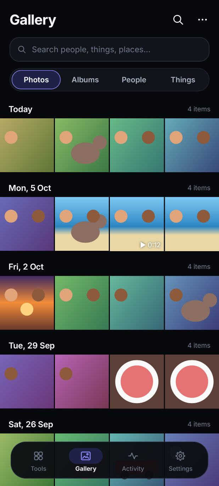 | 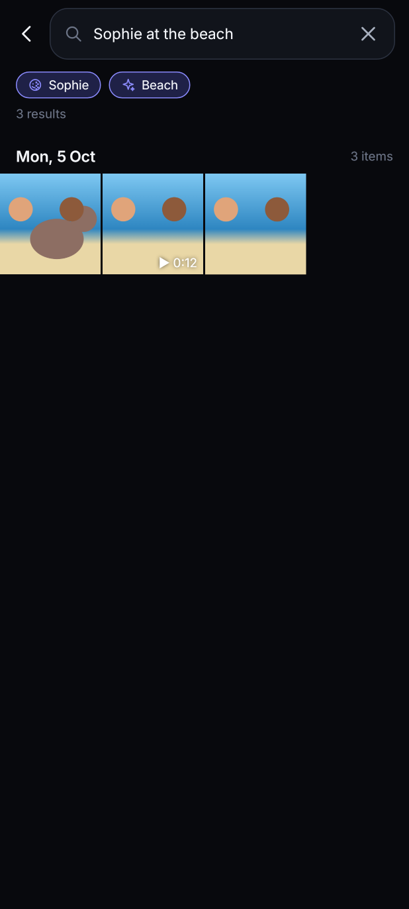 | 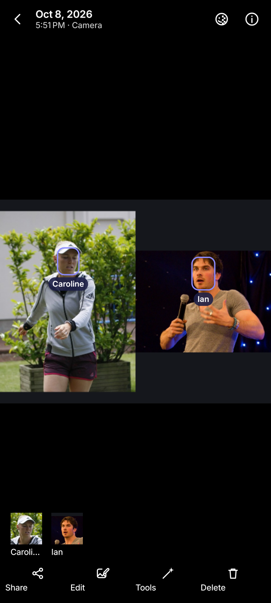 | 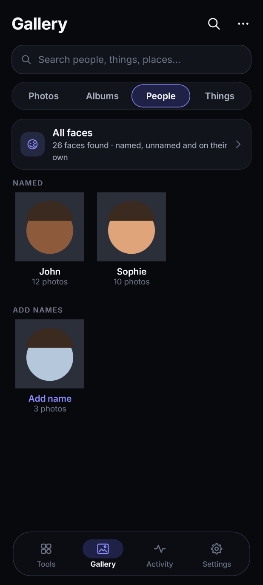 | 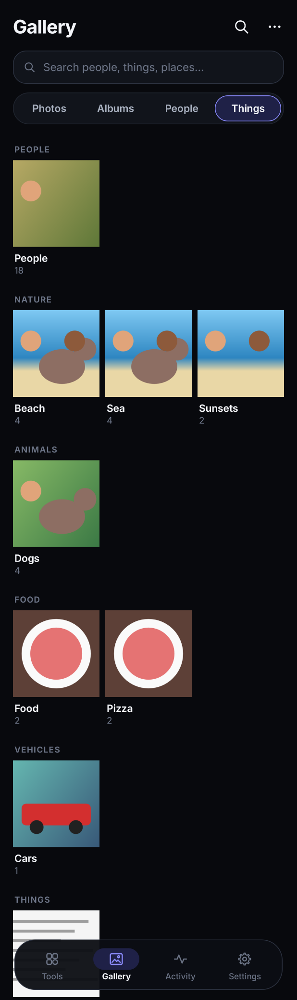 | 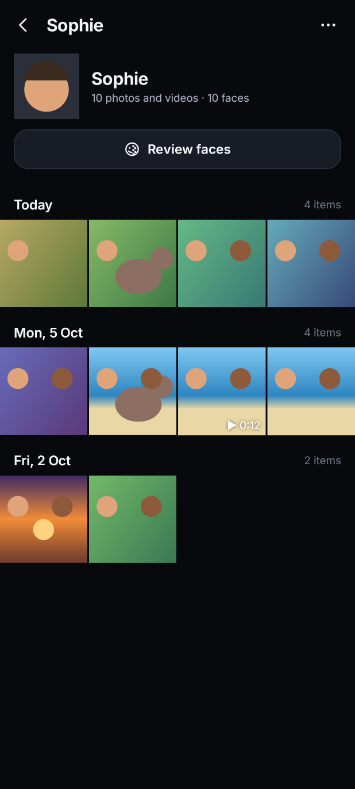 | 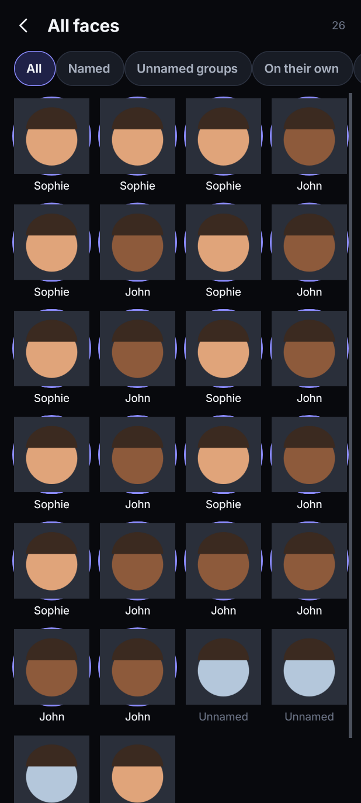 |

Gallery screenshots show Creative Commons photos (CC BY 2.0) of Caroline Wozniacki, Ian Somerhalder and
Kelly Clarkson by Andrew Campbell, karlnorling, cirodelia47, Jean & Nathalie and vagueonthehow (sources
in [`CREDITS.tsv`](app/src/test/resources/people/CREDITS.tsv)), as the app found and grouped them.

| Highlight video | Duplicate finder | One group at a time | Name people |
|---|---|---|---|
| 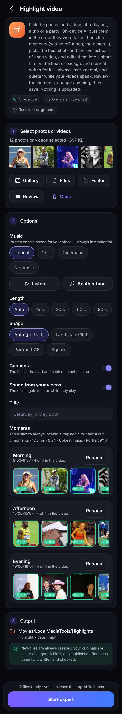 |  | 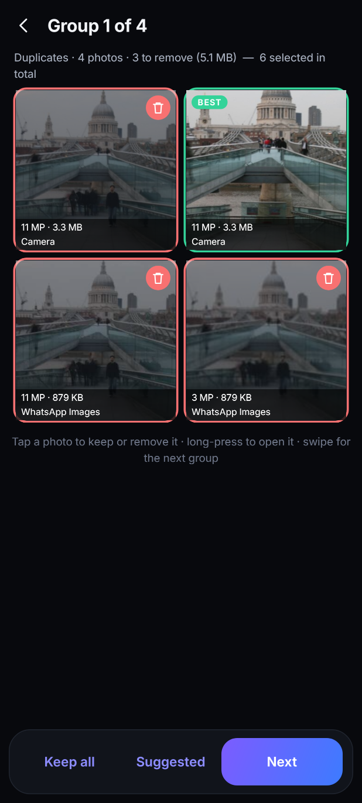 | 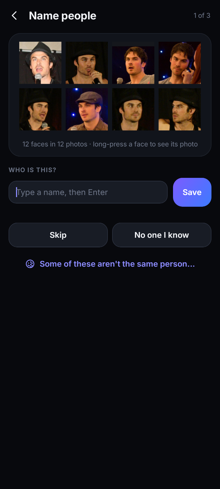 |

| Print | Choosing the printer |
|---|---|
| 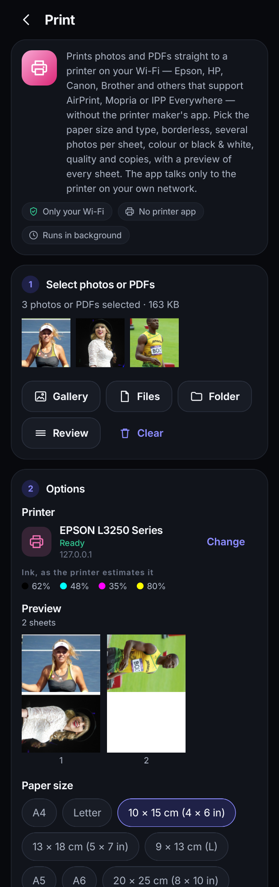 | 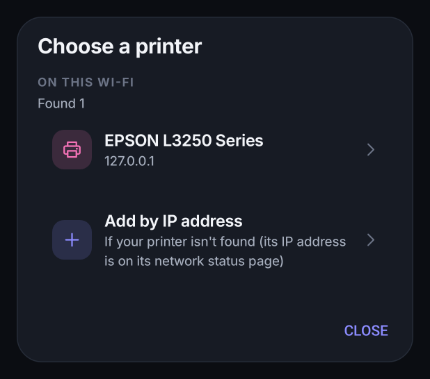 |

| Tool stack | Setting up a step | Choosing the next tool |
|---|---|---|
| 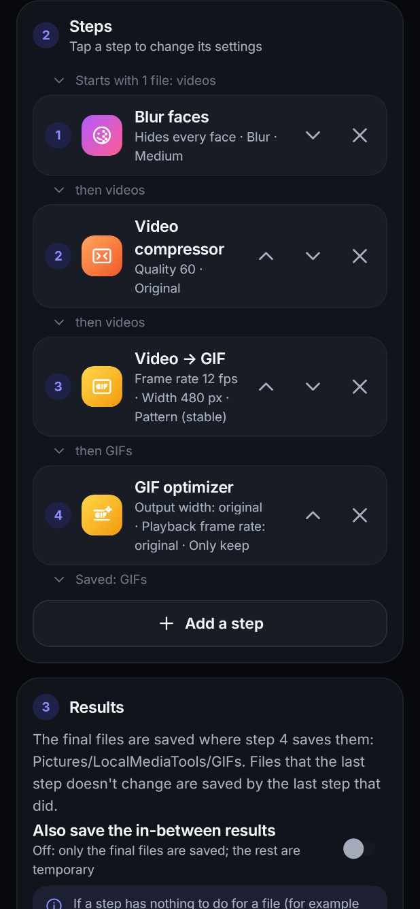 | 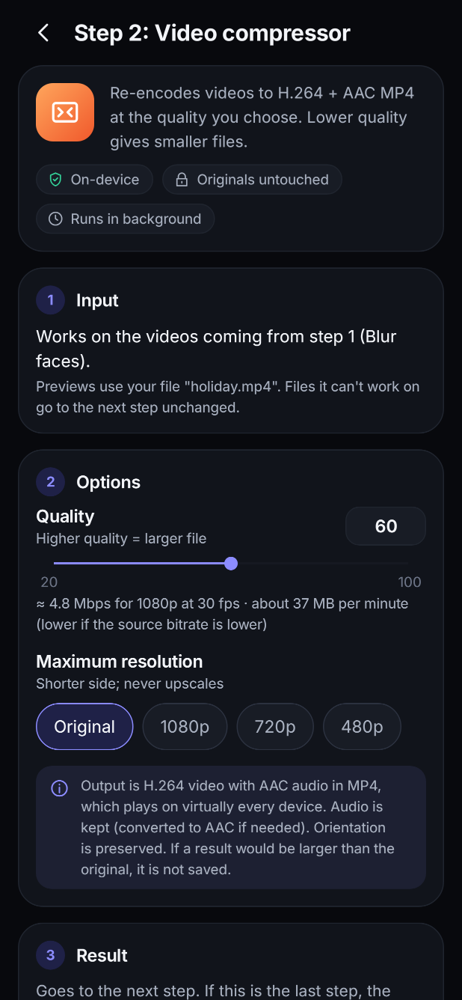 | 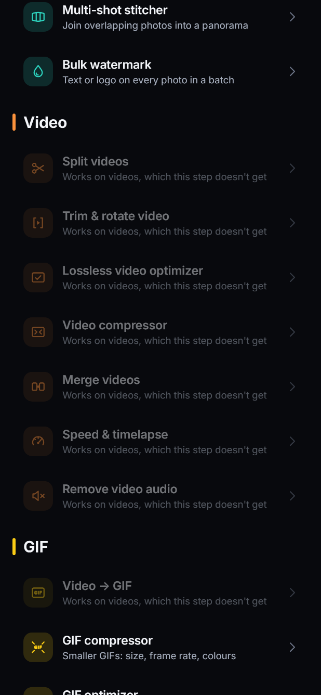 |

| Home | Blur faces | Background remover | Auto enhance | Speed & timelapse |
|---|---|---|---|---|
|  |  |  |  |  |

| Magic eraser | Looks | Crop & straighten | Settings |
|---|---|---|---|
|  |  |  |  |

## What's new in 1.7.0: highlight videos, a precise duplicate finder, naming people quickly

- **Highlight video** (new, in Video): pick the photos and videos of a day out, a trip or a party.
  The app puts them in the order they were taken (photo and video clocks lined up: EXIF local time
  and zone, video UTC), splits them into **moments** where there's a long pause or the scene changes,
  and names each from what's in it and the time of day ("Setting off", "Lunch", "At the beach",
  "Sunset", "Dinner", "Day 2 · Breakfast"…). It scores every shot (sharpness, exposure, faces,
  favourites; a burst counts once), gives each moment its share of the length, takes the liveliest
  stretch of each video (movement, faces, sound) and edits it all **chronologically on the music's
  beat**: cuts within a moment, cross-fades between moments, a slow zoom on photos that keeps faces in
  view, pictures of another shape shown whole over a blurred copy of themselves, the title and each
  moment's name on screen. Landscape, portrait or square (automatic: the shape most of your pictures
  have), 15–90 s or automatic.
- **Change anything before saving**: the timeline shows every moment with its shots and marks the
  ones in the edit with their length; tap a shot to always include it, again to leave it out; rename
  moments, set the title, turn captions or the videos' own sound off.
- **Background music written on the phone, always instrumental**: an open-source music model,
  Magenta's MusicVAE "trio" (Apache-2.0, Google), writes melody, bass and drums for your video; the
  app arranges it (intro, verses, chorus, outro, every note in one key, chords for a pad) and plays it
  with its own synthesized instruments — no recordings and no voices anywhere in the chain. Upbeat,
  Chill or Cinematic, **Another tune**, and **Listen** before saving. While a video clip plays its own
  sound, the music steps back to 22 % (smoothly, 250 ms down, 400 ms up) and returns after it.
- **Duplicate finder: no more unrelated photos called the same.** Every match now needs two
  independent signals (the image model *and* the picture's layout, or matching details found by a
  feature check), similar shots must be taken within 10 minutes of each other, pages of text and dark
  shots only match as true copies, and photos taken seconds apart are never treated as copies of each
  other. Measured through the app's own code on 8,466 real photos (Flickr, CC BY 2.0, including 1,905
  labelled look-alikes: screenshots, documents, night skies, clouds, snow…): **groups with unrelated
  photos 4 → 0** (1.6.0: 53 wrong pairs, the largest group 13 photos), re-saved copies still found
  (1,475 of 1,500; 1.6.0: 1,483), the same in both halves of the test set; details in
  [`buildtools/duplicates/README.md`](buildtools/duplicates/README.md).
- **Keep rules** decide what is suggested: always keep RAW photos (and the best other copy next to
  them), favourites, and photos of the people you choose from the Gallery; which copy to keep (best
  quality, the original, the newest, the smallest); optionally suggest similar shots too (the sharpest
  stays). Copies are suggested; similar shots are yours to decide.
- **Much faster to go through**: one list with each group's photos large, tap to keep or remove,
  long-press to open; **Keep all** / **Suggested** per group; sort by space, date or size of group;
  only copies or only similar shots; or **Review one by one** with swipes. The scan reads thumbnails
  on several cores.
- **Name people quickly**: the People tab's **Name people** goes through the unnamed groups biggest
  first, eight faces at a time: type a name and press Enter (an existing name adds the faces to that
  person), tap a suggestion ("This is Ana", only when the faces really match) or a recent name, Skip,
  "No one I know", or split off the faces that aren't the same person. Suggestions were measured on
  802 faces of 78 real people: the old thresholds would have suggested 39 wrong names, the new ones
  none (checked on people they weren't tuned on).
- **Lighter and faster**: the music is written in 0.6 s and played in 1.4 s for 90 s on the build
  machine (2.8× and 2.2× faster than this version's first draft) with 53 MB instead of 124 MB of
  working memory, the mix is made in the music's own buffer, and the object and scene models are
  freed as soon as a highlight video no longer needs them.
- **Tested** on real photos of real people (faces kept in frame on every frame of every shape;
  reference frames drawn from the plan), the music model against its own JavaScript implementation
  (the same choice at every one of 384 steps), the sound mix, capture times, moments and the timeline
  screen. **Not yet run on a phone**: the GPU drawing and H.264/AAC encoding of the highlight video
  can't run in the build environment (no phone or emulator); they reuse the app's existing video
  engine's way of decoding, drawing and encoding, and were reviewed line by line, but the first
  exports on real phones are the real test.

## What was new in 1.6.0: printing, without the printer's app

- **Print photos and PDFs** straight to a printer on your Wi-Fi — the Epson L3250 and other printers
  that support AirPrint, Mopria or IPP Everywhere (most current Wi-Fi printers). No printer app or
  driver: the app speaks the standard printing protocol (IPP) itself and draws the pages on the phone,
  in the formats these printers take (PWG raster, Apple raster, JPEG or PDF, whichever the printer
  prefers).
- **Finds your printer** on the Wi-Fi in a few seconds, or add it by IP address; it is remembered,
  and found again if the router gives it a new address. Works on a printer's own Wi-Fi Direct network.
- **See every sheet before printing**: the printer's own paper sizes (A4, Letter, 10 × 15, 13 × 18,
  9 × 13…) and paper types (plain, glossy, matte…), borderless where the printer allows it, 1–9 photos
  per sheet (whole photo or filling the space, turned to fit), PDF page ranges and actual size, colour
  or black & white, draft / normal / best (photo paper picks best), copies.
- **Plain-word status**: ready, printing, "Add paper", "Paper jam", cover open, ink as the printer
  estimates it; printing runs in the background with progress in the notification and Activity, and
  can be cancelled.
- **Print from anywhere**: the photo viewer and gallery selection, the results of any tool, and
  "Print (Local Media Tools)" in other apps' share menus (a PDF from e-mail or WhatsApp, say).
- **Privacy, enforced in code**: printing needs network access, so the app now has it — for the local
  network only. Every connection is checked to go to a local address (192.168.x, 10.x, 172.16–31.x,
  link-local, IPv6 local); printers are found with multicast DNS on the Wi-Fi and addressed by IP, so
  no name lookup can reach outside; a test fails the build if any other code touches the network.
  Encrypted printing (IPPS) is used when the printer offers it, trusting the printer's own
  certificate the first time and only that one afterwards.
- **Tested** with real photos against a simulated Epson L3250 (described the way Epson EcoTanks
  describe themselves over IPP) and against CUPS's reference IPP Everywhere printer, `ippeveprinter`,
  over plain and encrypted IPP; CUPS's own filters read the pages exactly as drawn
  (`buildtools/print/cups_check.sh`). Not yet on a real L3250.
- **Not possible this way**: printer maintenance (nozzle check, head cleaning) uses Epson's private
  protocol — use the printer's buttons or Epson's app for that.

## What was new in 1.5.0: one person, one group

People were too often split into several "people", or left out of their group, especially with a
cap, sunglasses, stage make-up, a big laugh or a face turned away. Measured on real photos: 802
faces of 78 people, checked by eye, in 1,233 Creative Commons photos taken by many photographers
over the years, with the 3,776 other faces in those photos as strangers (all faces at once, through
the app's own code):

| Share of a person's faces in their main group | 1.4.1 | 1.5.0 |
|---|---|---|
| All | 75 % | 87 % |
| With a cap, hat or visor | 54 % | 68 % |
| With glasses or sunglasses | 78 % | 86 % |
| With heavy make-up | 56 % | 75 % |
| With a strong expression | 77 % | 89 % |
| Turned | 75 % | 88 % |
| In profile | 43 % | 73 % |
| Small, far from the camera | 43 % | 68 % |
| **Faces put with the wrong person** | 0.2 % | 0.7 % |

The settings were tuned on half of the people and checked on the other half, which they had never
seen: there, 77 % → 87 % of each person's faces were in their main group, with no faces mixed up.

- **How** — a face is now compared with each group's *mean face* rather than with the average of all
  its faces, so someone photographed in very different conditions (whose photos agree less with each
  other) still forms one group; faces the detector is unsure about (blurry, half hidden) stay on
  their own instead of joining the wrong person; the "is this…?" and look-alike suggestions were
  recalibrated on the same photos.
- **Your library is regrouped once** after updating (photos aren't scanned again; names and
  corrections are kept).
- **Still hard** — dark sunglasses with a hat can make two people look alike (most of the wrong faces
  above), and in a small library someone whose looks vary a lot can still appear twice until more
  photos connect the two; a person's page suggests look-alike groups to merge.
- **Tests use real people** — the app's tests now run on 63 Creative Commons photos of nine public
  figures (credits in [`app/src/test/resources/people`](app/src/test/resources/people)): the real face
  models and grouping on the JVM, and the gallery screens (and screenshots) on real photos and faces.

## What was new in 1.4.1: Gallery hardening

A review of the Gallery aimed at what only shows up on real phones, and the fixes:

- **Recognition exactly as calibrated** — photos are now shrunk for the recognisers exactly the way
  they were during calibration (Pillow's resampling, reproduced bit for bit); all 2,000 test photos
  now get exactly the tags measured in calibration (1.4.0: 93 % did).
- **People and names are never lost by accident** — the library is never read without permission,
  a failed or empty read removes nothing, and a sudden loss of more than half of a big library only
  counts when a read half an hour later confirms it.
- **Background indexing ends cleanly** — errors, pausing and Android's time limits no longer leave
  the notification stuck "working"; a photo that keeps failing (or crashing the app) is skipped after
  two tries; results from a temporary failure are redone instead of being kept as "nothing found";
  while charging, indexing continues with the screen off.
- **Lighter on big libraries** — people are regrouped after a growing number of new faces (not every
  300), deleting photos no longer triggers a full regroup, open screens refresh only while visible,
  and only changed library entries are rewritten; naming someone during indexing takes effect at once.
- **Fixes** — faces from videos show the right frame; a person's page no longer closes another
  screen; with Android 14's "selected photos" access the Gallery offers to allow more; Android 10 can
  delete (one at a time: it has no trash); sharing and deleting take up to 500 items at a time, with a
  clear message beyond.

## What was new in 1.4: Gallery

- **Your photos and videos, organised on the phone** — a new Gallery tab shows everything by day
  (**Photos**), by folder (**Albums**), by person (**People**) and by what is in them (**Things**).
  The viewer shares, opens the photo editor, runs any tool on the photo, and deletes through
  Android's own confirmation. Works with "allow selected photos only", too.
- **Search in plain words** — names (*Sophie*; *John and Sophie* finds photos with both), things
  and places (*dog*, *beach*, *pizza*, *sunset*, *documents*), albums (*WhatsApp Images*), dates
  (*June 2023*, *last month*, *2024*) and kinds (*videos*, *screenshots*), freely combined: *Sophie
  at the beach 2024*. Small typos are forgiven and shown (*Jonh* → John).
- **People** — [YuNet](https://github.com/opencv/opencv_zoo/tree/main/models/face_detection_yunet)
  finds faces, [SFace](https://github.com/opencv/opencv_zoo/tree/main/models/face_recognition_sface)
  recognises them, and faces of the same person are grouped automatically. The grouping is
  deliberately strict, so different people don't end up together: tuned on several hundred real
  faces of 16 people, it made no wrong merges in two of three trials (0.4 % in the third) while
  keeping most of each person's faces together (87 % by the usual B-cubed measure). Name a group once and new photos of that
  person join it. In the viewer, faces are outlined with names; tap one to name it, pick someone
  else, or say *this isn't Sophie* (remembered for good). Merge two groups, hide someone, review all
  of a person's faces, accept or reject *Also Sophie?* suggestions, and see **all faces** found,
  including small or blurry ones that are never grouped on their own.
- **Things** — 86 categories (people, animals, vehicles, food and drink, nature and places,
  rooms, sports, documents and more), recognised by two on-device models:
  [EfficientDet-Lite2](https://ai.google.dev/edge/mediapipe/solutions/vision/object_detector) finds objects,
  and [EfficientNetV2-B3](https://github.com/google/automl/tree/master/efficientnetv2) pre-trained
  on ImageNet-21k recognises 21,843 kinds of things and scenes, grouped into categories with
  WordNet, plus small recognisers trained for scenes it has no class for (sunsets, night,
  waterfalls, pools, weddings…). Videos are looked at in several frames.
- **Calibrated, not guessed** — every category's thresholds were set on 13,455 Open Images photos
  with human-verified labels, aiming at 90 % precision (a photo tagged *dog* shows a dog at least
  9 times in 10), with cross-validated results; 71 of the 86 categories reach at least
  85 % this way (median 90 %), the others 78–84 %. Categories that couldn't be recognised reliably were left out (shoes, hats,
  computers, churches, Christmas…). Per-category numbers: [docs/gallery-calibration.md](docs/gallery-calibration.md).
- **Runs quietly in the background** — at low priority with a quiet notification, pausing when the
  battery is below 15 % (unless charging) or the phone is hot; can be paused in Settings. New photos
  are picked up while the app is open (and each time it starts); deleted ones leave the index. The
  index stays on this phone.
- **Fallback** — on a phone where the AI models can't run, the gallery still works: Android's
  built-in face finder is used and faces are only grouped when near-identical, so people are named
  by hand. Auto enhance now uses the gallery's scene recogniser too.

## What was new in 1.3: tool stacks

- **Tool stack** (home screen, or **Then run another tool** at the bottom of any tool) — pick files
  once, add tools in order and run them with one tap. Each step works on the results of the step
  before, e.g. *Blur faces → Video compressor → Video → GIF → GIF optimizer*, or *Convert images →
  Background remover → Bulk watermark*.
- **Every option stays available**: adding or editing a step opens that tool's own screen (with
  previews of your files) and an **Add to stack** button; the stack lists each step with a short
  summary of its settings. Steps can be reordered, edited and removed.
- **Easy to follow**: between the steps the stack shows what flows on (photos, videos, GIFs,
  PDFs); the tool picker greys out tools that can't use what arrives at that point and says why.
- **Nothing gets lost**: in-between results are private temporary files (or saved too, if you
  switch that on); only the final files are saved, in the folders of the tools that made them. A
  file a step can't work on, or has nothing to do for (say it's already small), goes on unchanged.
  If a step fails for one file, the others continue.
- **Blur faces in a stack**: people you choose are recognised again by their faces at that step,
  so it also works after other steps; faces that look like no one you kept visible are hidden.
  **Trim** in a stack keeps the same part (as a share of the length) of every video.

## What was new in 1.2

- **Blur faces (photos and videos)** — [YuNet](https://github.com/opencv/opencv_zoo/tree/main/models/face_detection_yunet)
  finds every face; [SFace](https://github.com/opencv/opencv_zoo/tree/main/models/face_recognition_sface)
  recognises the same person across frames and across all the selected files, so each person is
  listed once with a face picture. Tap who to hide (everyone is pre-selected), choose blur or
  pixelate and a strength. In videos, faces are tracked frame to frame (sampled several times a
  second, interpolated in between, never merging two faces seen at the same moment) and hidden on
  the GPU while re-encoding; the sound is kept as is. In photos, the hiding scales with the face so
  close-ups are anonymised too. The photo editor's Blur tab also has **Hide all faces**.
- **Background remover** — [U²-Net-p](https://github.com/xuebinqin/U-2-Net) (as packaged by
  [rembg](https://github.com/danielgatis/rembg)) finds the subject; a guided filter snaps the mask
  to real edges. Transparent PNG or white/black/grey background, optional crop to the subject,
  live preview, batch.
- **Auto enhance** — one tap in the editor's Adjust tab, or a batch tool. Faces (YuNet) and the
  kind of scene (EfficientNet-Lite0: food, landscape, plants, city, documents, animals, night…)
  steer exposure, contrast, highlights/shadows, white balance, vibrance and sharpening. The result
  is ordinary editor settings, so you can still fine-tune them.
- **Duplicate finder** — scans the photo library (asks for photo access only when you start it):
  identical files (SHA-256), re-saved/resized copies (difference hash) and near-identical shots
  (MobileNet-V3 image embeddings, with a looser threshold for bursts taken seconds apart). The
  sharpest, largest photo is marked as the best; copies are pre-selected; moving to the trash goes
  through Android's own confirmation and can be undone from the gallery for 30 days. Results are
  cached, so later scans only look at new photos.
- **Merge videos** — clips recorded with the same settings are joined without re-encoding;
  otherwise each is converted to a common size (letterboxed), frame rate and AAC sound (silence
  for clips without sound) and then joined.
- **Speed & timelapse** — 0.25× to 60×. Sound keeps its natural pitch (WSOLA time-stretching) up
  to 4×; muted copies up to 120 fps are only re-timed (no re-encoding); timelapses are smooth 30 fps.

## What was new in 1.1

- **Magic eraser** — brush over people or objects; [MI-GAN](https://github.com/Picsart-AI-Research/MI-GAN)
  (MIT) converted to TensorFlow Lite fills the gap on the phone. It works on a window around the
  stroke, so full-resolution photos keep their detail; edges are feathered and grain is matched.
  Falls back to a classic fill (OpenCV Telea) where the model can't run.
- **Photo editor** — crop with aspect presets, rotate, flip, straighten (auto-zoomed so no empty
  corners), 11 adjustments (exposure, brightness, contrast, highlights, shadows, saturation,
  vibrance, warmth, tint, sharpness, vignette), 10 looks with strength, undo/redo, hold-to-compare.
  Saving runs in the background at full resolution in memory-bounded strips.
- **Blur & pixelate** brushes to hide faces, number plates or addresses.
- **Trim & rotate video** (lossless), **Extract PDF pages**, **Remove metadata** (GPS, camera,
  dates, XMP, hidden thumbnails and extra images; pixels copied byte for byte, orientation and
  colour profile kept).
- **New design** — Tools / Activity / Settings navigation, tool search with synonyms, categories,
  Inter typeface, gradient tool icons, a new adaptive app icon with a themed (monochrome) layer.

## Tools

| Section | Tool | What it does | Saved to |
|---|---|---|---|
| Stacks | Tool stack | Runs any of the tools below in a row on the same files | Where the last tool saves |
| Edit & AI | Photo editor | Crop, rotate, straighten, adjustments, looks, auto enhance | `Pictures/LocalMediaTools/Edited` |
| | Magic eraser | On-device AI object removal | `Pictures/LocalMediaTools/Edited` |
| | Blur & pixelate | Privacy brushes, hide all faces | `Pictures/LocalMediaTools/Edited` |
| | Background remover | AI cut-out, transparent PNG or plain colour | `Pictures/LocalMediaTools/Cutouts` |
| | Auto enhance | AI-assisted one-tap fixes, batch | `Pictures/LocalMediaTools/Enhanced` |
| | Blur faces | Find faces in photos and videos, choose who to hide | `Pictures/…/Blurred faces`, `Movies/…/Blurred faces` |
| Images | Image compressor | JPEG/WebP, quality, max width (0 = original), never saves a larger file | `Pictures/LocalMediaTools/Compressed` |
| | Lossless image optimizer | Pixel-identical PNG or lossless WebP | `Pictures/LocalMediaTools/Compressed` |
| | Convert images | PNG/JPEG/WebP from HEIC, AVIF, TIFF, BMP, PSD, QOI, PNM, TGA, … | `Pictures/LocalMediaTools/Converted` |
| | Merge images | Vertical / horizontal / smart pack; no scaling; streamed in strips | `Pictures/LocalMediaTools/Merged` |
| | Multi-shot stitcher | Panoramas and flat scans in any arrangement, optional AI alignment assist | `Pictures/LocalMediaTools/Stitched` |
| | Bulk watermark | Text and/or logo, per-aspect-ratio placement | `Pictures/LocalMediaTools/Watermarked` |
| | Duplicate finder | Copies and similar shots in the photo library, best one kept | — (moves to the system trash) |
| Video | Split videos | Equal-length parts, stream copy | `Movies/LocalMediaTools/Splits` |
| | Trim & rotate video | Keep a range (start snaps to a keyframe), 90° turns, no re-encode | `Movies/LocalMediaTools/Trimmed` |
| | Lossless video optimizer | Remux to a fast-start MP4 | `Movies/LocalMediaTools/Optimized` |
| | Video compressor | H.264 re-encode, quality 20–100 | `Movies/LocalMediaTools/Compressed` |
| | Merge videos | Join clips in your order; lossless when possible | `Movies/LocalMediaTools/Merged` |
| | Speed & timelapse | 0.25×–60×, natural-pitch sound | `Movies/LocalMediaTools/Speed` |
| | Highlight video | Photos and videos of an event edited into a short film on the beat of on-device instrumental music; moments, best shots, captions | `Movies/LocalMediaTools/Highlights` |
| | Remove video audio | Video stream copied, audio dropped | `Movies/LocalMediaTools/NoAudio` |
| GIF | Video → GIF | FPS, width, source mode, adaptive colours | `Pictures/LocalMediaTools/Converted/GIF` |
| | GIF compressor | Width, FPS, 32/64/128/256 colours | `Pictures/LocalMediaTools/GIFs` |
| | GIF optimizer | Pixel-preserving re-pack | `Pictures/LocalMediaTools/GIFs` |
| PDF | PDF → images | PNG/JPEG, scale 50–400 % | `Pictures/LocalMediaTools/PDF Images` |
| | Images → PDF | A4 pages in your order | `Documents/LocalMediaTools/PDF` |
| | Merge PDFs | Structural merge: text and links kept | `Documents/LocalMediaTools/PDF` |
| | Extract PDF pages | `1-3, 5, 8-` into one PDF or one per page | `Documents/LocalMediaTools/PDF` |
| | PDF scanner | Camera and gallery pages, A4 | `Documents/LocalMediaTools/PDF` |
| Print | Print | Photos and PDFs on AirPrint / Mopria / IPP Everywhere printers on the Wi-Fi: paper size and type, borderless, 1–9 per sheet, colour, quality, copies, preview | — (prints) |
| Privacy & audio | Remove metadata | Lossless clean copies of JPEG/PNG/WebP/GIF and videos | `Pictures/…/Clean`, `Movies/…/Clean` |
| | Extract audio | AAC track to M4A without re-encoding | `Music/LocalMediaTools/Extracted Audio` |

Exports run in a foreground service with progress notifications and one queue for the whole app.
The **Export workload** setting (10–100 %, Efficient / Balanced / Fast) controls parallelism,
thread priority, pauses and the memory budget, live, even mid-export.

## Building

No Android SDK or Gradle is needed; the build uses a pinned, self-downloaded toolchain
(aapt2, android.jar 35, Kotlin compiler, D8, apksigner).

```bash
python3 buildtools/fetch_toolchain.py                # once: downloads + verifies the toolchain into .toolchain/
python3 buildtools/build_apk.py                      # -> build/LocalMediaTools.apk (signed)
python3 buildtools/build_apk.py --test               # + JVM unit tests
python3 buildtools/fetch_toolchain.py --robolectric  # once, optional (needs mvn)
python3 buildtools/build_apk.py --robo-test          # + Android-framework tests in Robolectric
```

The on-device models are committed in `app/src/main/assets/models/` with their licences in
`app/src/main/assets/licenses/` (also shown in Settings → Open-source licences): YuNet (MIT) and
SFace (Apache-2.0) from the OpenCV Zoo, U²-Net-p (Apache-2.0, via rembg, MIT), EfficientDet-Lite2
(Apache-2.0, MediaPipe), EfficientNetV2-B3 ImageNet-21k (Apache-2.0, Google AutoML) and the decoder
of Magenta's MusicVAE trio model (Apache-2.0, Google; run by the app's own Kotlin code, checked
against magenta.js, see [`buildtools/music/`](buildtools/music/README.md)). The ONNX
models run through OpenCV's DNN module, the TFLite ones through TensorFlow Lite. How the gallery's
recognition files were made and calibrated (EfficientNetV2 with int8 weights, its 4-bit output
layer, the probes and the category table) is in [`buildtools/gallery/`](buildtools/gallery/README.md). The eraser model (`migan_512_fp16.tflite`, 14 MB) is committed too;
`buildtools/models/convert_migan.py` reproduces it byte for byte from the published MI-GAN weights
(TorchScript → ONNX → TFLite float16 with TensorFlow 2.16.1, matching the app's TFLite runtime) and
checks it against PyTorch. Google's Maven repository wasn't reachable from the build environment,
so the app uses only the Android framework (no AndroidX) plus kotlinx-coroutines, OpenCV,
pdfbox-android and TensorFlow Lite from Maven Central.

The release APK is signed with the sideload key in `buildtools/signing/` (password `localmediatools`)
so updates install over each other; use your own key for a store release.

## Tests

* `app/src/test` — 112 JVM tests: codecs, orientation, layouts, MP4 fast start, stitching, editor
  geometry and colour pipeline, masks and mosaics, the metadata stripper (JPEG/PNG/WebP/GIF), the
  real vision models (face detection and recognition, tracking and grouping people across photos
  and videos, cut-out masks, auto enhance, duplicate grouping), the sound pipeline (resampling,
  channel mixing, pitch-preserving speed changes) and the gallery core: detector decoding against
  the model's anchors, people grouping (no mixed groups, names and "not this person" respected,
  blurry faces only joining clear matches; on 63 real photos with the real face models: everyone
  found again, nobody mixed up, and most of each person's faces grouped together with caps, glasses,
  make-up, expressions, turned and small faces), search parsing (names, typos, dates, albums, kinds),
  score fusion, resizing bit-identical to Pillow, and the shipped 4-bit scene layer and category table
  reproducing the calibration's scores on real photos' features; and printing: IPP messages, the
  local-network rule (and a scan of the source that nothing else uses the network), finding printers
  from their announcements, PWG and Apple raster decoding to the exact pixels, sheet layout, and whole
  jobs of real photos to a simulated Epson L3250 (paper, borderless, grayscale, quality, copies, a
  printer that refuses streamed jobs, AirPrint-only and JPEG-only printers, no paper, cancelling).
  `buildtools/print/cups_check.sh` also prints to CUPS's reference IPP Everywhere printer
  (`ippeveprinter`, plain and encrypted) and has CUPS's own filters read the pages back. New in 1.7:
  the duplicate finder on real photos (same moments and re-saved copies grouped; other angles and the
  hardest look-alikes — clouds, night skies, printed pages, screenshots taken seconds apart — never;
  the thumbnail layout matching the evaluation's; keep rules; 20,000 photos compared in seconds), name
  suggestions on the 802 labelled faces (none wrong), the music model decoding exactly like
  magenta.js, composing (repeatable, in key, long enough) and synthesis (no clipping, steady level,
  fades), capture times from photos and videos, moments and their names, the edit (chronological, on
  the beat, bursts once, choices kept, the liveliest part of videos), each frame's layers and fades,
  texture coordinates for every video rotation, the sound mix with the music stepped back, and real
  people's faces kept in frame on every frame in all three shapes.
* `app/src/roboTest` — 61 Robolectric tests (Android 15 runtime, native graphics): EXIF orientation
  through decoding and export; every image, GIF and PDF tool end to end; the editor at full
  resolution (rotation, flip, crop, straighten, colours equal to the preview pipeline, eraser and
  privacy brushes); the editor UI (brush stroke → erase → undo/redo → rotate → save); metadata
  removal keeping photos upright; page extraction; background removal, auto enhance and photo face
  blurring end to end (with stand-ins for the native models); tool stacks (real tools chained end to
  end, temporary in-between files, files passing steps that can't use them, merging, failures,
  and building and running a stack in the UI); the gallery on a stand-in photo library of real photos and faces (indexing,
  grouping people, naming, search with typos, face names in the viewer, "not this person"
  surviving regrouping, removed photos leaving the index, empty or failing library reads and a
  sudden big drop not wiping the index, failing photos retried once, pausing, and every gallery screen);
  printing from the Print screen to the simulated L3250 (finding it, its state and ink, its paper
  sizes and types, borderless photos two per sheet, the job it receives; a printer added by IP
  address falling back from encrypted to plain IPP; files shared from other apps); the duplicate
  finder's screens on real photos (suggestions, a tap changing one photo, keep rules, RAW files and
  their best copy, never suggesting photos of a person you keep, the one-by-one review); naming
  people one after another; the highlight video's timeline on real photos of people (moments, the
  draft edit, always in / left out, shape, length, renaming, music, and listening to the music the
  model writes); and a pass that opens every tool from the home screen. `LMT_SHOTS=<dir>` also renders the screenshots
  above.

Not covered by automated tests (no emulator here): a real printer (see above for what printing is
tested against), MediaCodec/MediaExtractor video paths (including the GPU face blur, merging and
speed changes, and the highlight video's analysis of videos, GPU drawing, H.264 and AAC encoding), PdfRenderer (also used to print PDF pages), BitmapRegionDecoder, the camera intent,
the photo-library scan and trash request, MediaStore and the background indexing service on a real
phone, and the native OpenCV/TFLite code on a device (the face and cut-out models are tested on the
JVM with OpenCV's desktop build, the eraser model against PyTorch, and the gallery's TFLite models
were measured with the same TensorFlow Lite version in Python, the app's Kotlin code then being
checked against those measurements).
