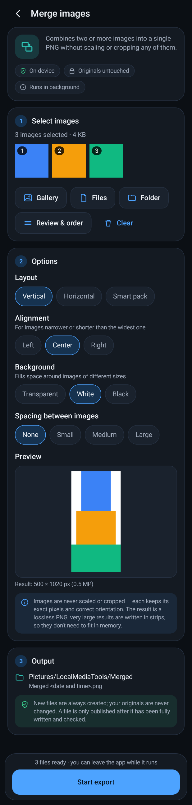
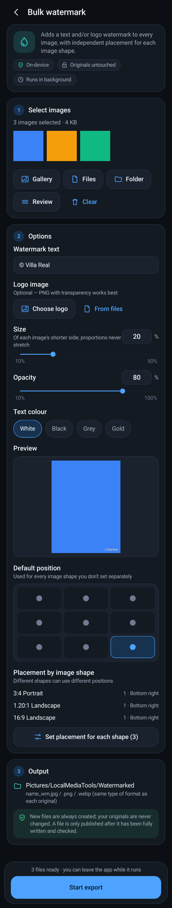
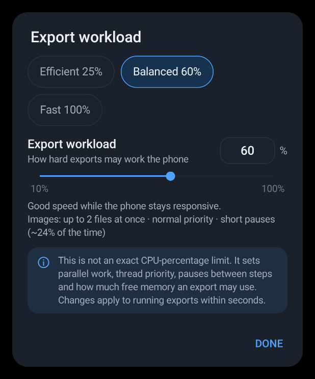

# Local Media Tools (Android)

A private, fully on-device media toolbox: 18 tools for video, images, GIF, PDF and audio.
Nothing is uploaded, originals are never modified, and every result is written to a hidden file
that is only published after it has been completely written and checked.

**Install:** [`release/LocalMediaTools-1.0.0.apk`](release/LocalMediaTools-1.0.0.apk)
(Android 10 or newer, arm64 / armv7; allow "install unknown apps" for your file manager or browser).

| Home | Merge images | Bulk watermark | Export workload |
|---|---|---|---|
|  |  |  |  |

## Tools

| Section | Tool | What it does | Saved to |
|---|---|---|---|
| Video | Split videos | Equal-length parts, stream copy (no re-encode) | `Movies/LocalMediaTools/Splits` |
| | Lossless video optimizer | Remux to a clean fast-start MP4, quality untouched | `Movies/LocalMediaTools/Optimized` |
| | Video compressor | H.264 re-encode, quality 20–100 (default 72), orientation kept | `Movies/LocalMediaTools/Compressed` |
| | Remove video audio | Video stream copied, audio dropped | `Movies/LocalMediaTools/NoAudio` |
| Images | Image compressor | JPEG/WebP, quality, max width (0 = original), never saves a larger file | `Pictures/LocalMediaTools/Compressed` |
| | Lossless image optimizer | Pixel-identical PNG or lossless WebP | `Pictures/LocalMediaTools/Compressed` |
| | Merge images | Vertical / horizontal / smart pack; transparent, white or black; no scaling; streamed in strips | `Pictures/LocalMediaTools/Merged` |
| | Multi-shot stitcher | Automatic overlap detection in any arrangement, crop to valid area, lossless PNG, optional on-device AI assisted alignment (only offered when the phone has the resources) | `Pictures/LocalMediaTools/Stitched` |
| | Bulk watermark | Text and/or logo, 10–50 % of the shorter side, 9 positions, per-aspect-ratio placement with a step-by-step plan | `Pictures/LocalMediaTools/Watermarked` |
| GIF | Video → GIF | FPS, width, source mode, adaptive colours | `Pictures/LocalMediaTools/Converted/GIF` |
| | GIF compressor | Width, FPS, 32/64/128/256 colours | `Pictures/LocalMediaTools/GIFs` |
| | GIF optimizer | Re-packs while every displayed pixel stays identical; rejects frames GIF can't represent | `Pictures/LocalMediaTools/GIFs` |
| Documents | PDF → images | PNG/JPEG, quality, scale 50–400 %, strip rendering | `Pictures/LocalMediaTools/PDF Images` |
| | Images → PDF | A4 pages in your order with a small margin, auto/portrait/landscape, JPEGs embedded without recompression | `Documents/LocalMediaTools/PDF` |
| | Merge PDFs | Structural merge: text, links and page sizes preserved | `Documents/LocalMediaTools/PDF` |
| | PDF scanner | Camera and gallery pages, reorder, A4 (image pages, no OCR) | `Documents/LocalMediaTools/PDF` |
| Utilities | Convert images | PNG/JPEG/WebP from HEIC, AVIF, TIFF, BMP, PSD, QOI, PNM, TGA, … | `Pictures/LocalMediaTools/Converted` |
| | Extract audio | AAC track to M4A without re-encoding | `Music/LocalMediaTools/Extracted Audio` |

Exports run in a foreground service with progress notifications, one queue for the whole app, and
an **Export workload** control (continuous 10–100 % plus Efficient / Balanced / Fast presets) that
sets parallelism, thread priority, duty-cycle pauses and the memory budget, live, even mid-export.

## Building

No Android SDK or Gradle is needed; the build uses a pinned, self-downloaded toolchain
(aapt2, android.jar 35, Kotlin compiler, D8, apksigner).

```bash
python3 buildtools/fetch_toolchain.py              # once: downloads + verifies the toolchain into .toolchain/
python3 buildtools/build_apk.py                    # -> build/LocalMediaTools.apk (signed)
python3 buildtools/build_apk.py --test             # + JVM unit tests (codecs, layouts, stitcher)
python3 buildtools/fetch_toolchain.py --robolectric  # once, optional (needs mvn)
python3 buildtools/build_apk.py --robo-test        # + Android-framework tests in Robolectric
```

The build pulls everything from Maven Central / GitHub / npm mirrors because `dl.google.com` and
`maven.google.com` were not reachable from the build environment; the app therefore uses only the
Android framework (no AndroidX), plus kotlinx-coroutines, OpenCV, pdfbox-android and TensorFlow Lite.

The release APK is signed with the sideload key in `buildtools/signing/` (password `localmediatools`).
It is committed so that updates install over each other; use your own key for a store release.

## Tests

* `app/src/test` — 29 JVM tests: PNG/JPEG/GIF/PDF writers and decoders, EXIF/HEIF orientation,
  merge layouts, MP4 fast start, and end-to-end stitching of synthetic shots.
* `app/src/roboTest` — 22 Robolectric tests (Android 15 runtime, native graphics): all 8 EXIF
  orientations through decoding and export, strip rendering with tiny memory budgets, every image,
  GIF and PDF tool end to end, explicit failures for truncated/invalid input, and a UI pass that
  opens all 18 tools from the home screen, selects files, walks the watermark placement steps and
  runs an export from the Start button. `LMT_SHOTS=<dir>` also renders the screenshots above.

Not covered by automated tests (no emulator here): MediaCodec video transcoding, MediaExtractor
remuxing, PdfRenderer, BitmapRegionDecoder, the camera intent and OpenCV/TFLite native code on a
device. These paths are written defensively and verify every output before publishing it.
